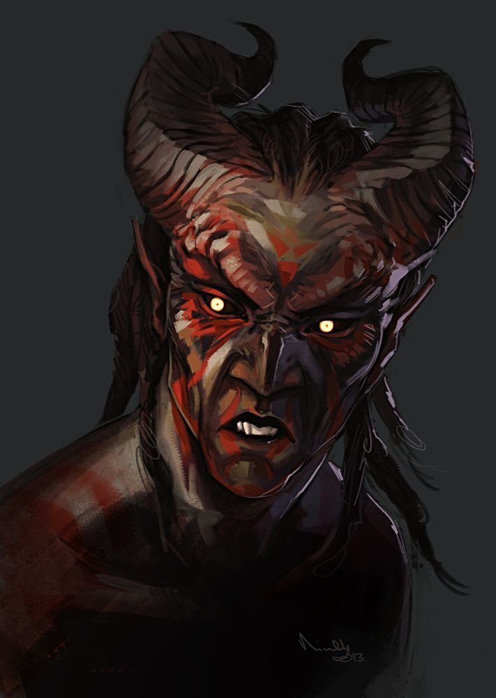

When he was young, he never understand why everyone treated him differently. After all, wasn't this a world where dwarves and dragonborn lived and worked alongside humans and elves? "It's just because they don't know you," Orryn always said. The librarian gnome was the closest thing Akmenos ever knew to a friend and perhaps even a father. And every time Akmenos came to him with the latest ordeal encountered with strangers, the wizened Orryn always seemed to have the time to listen.

That is, until the day the merchants came to town. Akmenos watched them from behind the crowd that had amassed in the streets to greet the wealthy visitors, and he stood agape at their resplendent garb- he never knew such things existed, and they seemed to be from a different world completely.

Akmenos ran to the library, excited to tell Orryn of a good experience for once. As soon as he burst in the door, he realized his friend was already preoccupied. Lo and behold, two of the merchants were already at Orryn's desk. Initially Akmenos was thrilled and in awe that he would have the opportunity to meet some of the figures he saw as deities. But as he drew closer, Akmenos realized the two wealthy men were in a heated argument with his mentor.

They were trying to purchase Aegr's Compendium, an ancient book almost larger than Orryn himself with worn, dark leather covers and bound by a spine with steel ridges. Akmenos never knew what it contained, but he knew that it was Orryn's most guarded possession. Orryn was refusing to sell it, but the merchants were not taking "no" for an answer.

Eventually the two men threw Orryn across the room, where he crumpled beside the shelves of books for which he spent his life caring. Akmenos yelled in shock, and his outburst prompted his friend to gasp, "It's alright, son, I'm alright." With that, Akmenos turned his attention to the merchants, blocking their exit from the establishment.

"Step aside, demon scum," the one carrying the book sneered as he and his companion drew concealed daggers from their shiny cloaks. "Return what you have stolen," Akmenos snarled back.

Before Akmenos realized what was happening, the companion was already beside him, and there was a deep gash across Akmenos's chest. It hurt, but he felt something else rush over the pain. It was like adrenaline, but it seemed to flow from somewhere deeper, and it seemed to have a soul of its own. The flow consumed him, and all he could see was red. All he could hear was red. He was screaming. No- it was a multitude of screams, deafening and drowning out all other sounds, sights, and feeling.
Then it stopped.

The blood red he saw became the dark, tattered cover of Aegr's Compendium he held in his hands. He was confused at how it got there, but he was happy he had successfully retrieved his friend's possession.

A moment later, however, the pages disintegrated through his hands. And as he looked up, his heart dropped and his blood froze. What was left of the library hardly resembled the building he remembered. The walls had turned to rubble, the shelves were rotting with decay, and the books- those wonderful tales Orryn had shared with him- they were gone- the pages turned to dust and only the most resilient of covers left with holes.

Had he traveled in time? Akmenos heard of creatures who had the ability to do so, but he thought they were stuff of myth. As he looked around, he recognized familiar storefronts and street signs. He even recognized Mrs. Miller, the innkeeper across the street. But when he looked again, he realized Mrs. Miller was standing as still as a rock, staring right at him. In fact, the entire neighborhood seemed to be fixated upon him. Akmenos heard a raven caw, and he realized the only audible sounds in the entire locale were the birds and the wind.

Then he saw them. Back in the ruins in which he stood- three charred skeletons with remnants of flesh dripping from the bones.
No- it couldn't be.

Yes, Akmenos had done this.

He never knew whether Orryn's death was caused by the injuries he sustained from the merchants, but Akmnos certainly sealed his fate. And ever since that day, he blamed himself for the end of his friend- his only friend. And never again would he trust anyone else.

He realized he had innate powers that were both useful and terrible. Every time he used them, he told himself it was out of necessity. He had to do what he must for survival, since he was alone in the world. But secretly he saw his acts as revenge and vindication for his friend's death. And subconsciously, he even savored it. He loved the power and the feeling that he had control over his fate and even others'. He hated how differently others had treated him, and now he embraced his uniqueness. He would be better than them, just wait and see.

As soon as he grew old enough and gathered enough coin, he bartered passage across the Crimson Sea. He wanted to escape the place that held so many tormenting memories, and he never wanted to see the land that had spit him out ever again. He made it his mission to seek answers about what secrets Aegr's Compendium had contained. If it had cost Orryn his life, surely it was valuable. And his first lead was the band of merchants who had fatefully made landfall in his humble slum.
