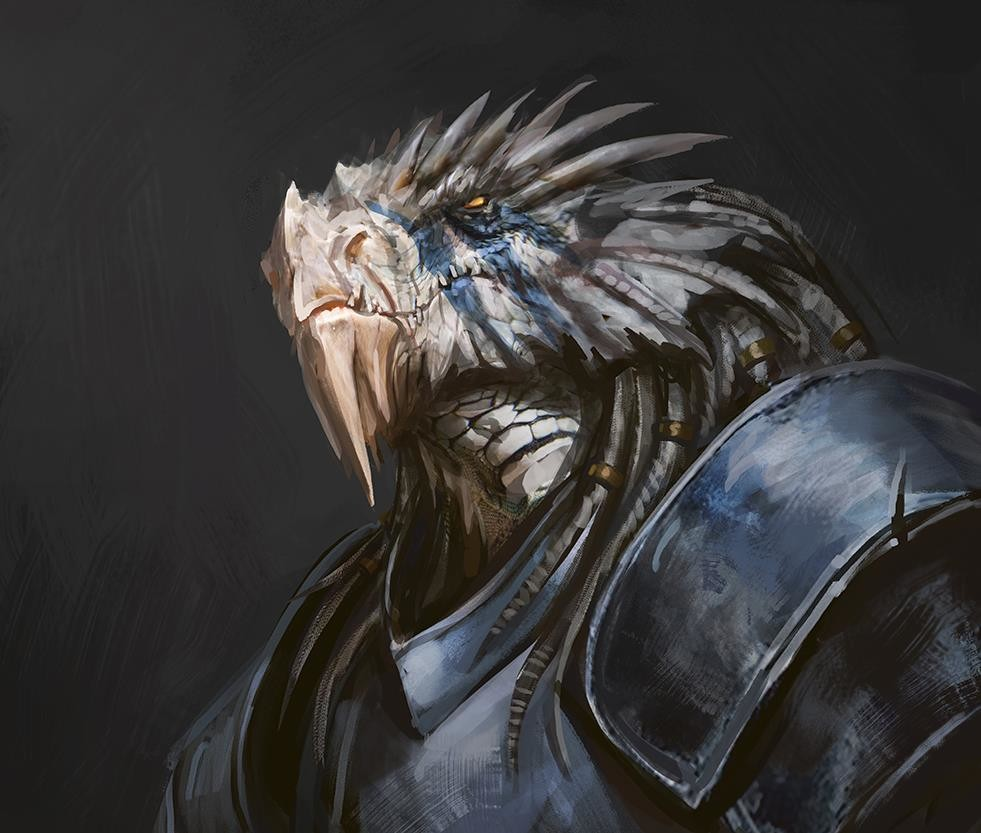

# Rhogar Drachedandion

Dragonborn Barbarian, Path of the Storm Herald

Rhogar Drachedandion grew surrounded by his clan knowing the rules, protect the clan above all else and keep the bloodline pure. Although he understood the concept of having honor in one's past, from a young age Rhogar knew deep inside that his clan's way of living was incorrect. Something was wrong with their way of "protection", it would lead the tribe to its end. Although they lived within the harsh cliffs of the mountains, every once in awhile, Dwarven miners would seek shelter during the fiercest storms, which the elders allowed, only because they took pity on the lower race. It was during these times, that Rhogar would eagerly speak and learn from the Dwarfs who visited. They taught him their language and about the world beyond the cliffs. He learned about the various races out in the world and how each unique, had different skills that benefit each other. Rhogar found this intriguing, especially the concept of marketplaces, it opened up all races to make a living, interact, and have a symbiotic relationship. When Rhogar brought this idea to the elders, the concept of opening their clan to travelers, like the miners, to trade that would be beneficial to them and the other races in the world. This did not sit well with the elders, who determined that action would make the clan weak and dishonored. To be rid of the dishonorable concept, it was decided to rid the provider of such thoughts and so Rhogar was cast from his clan to wander the lands outside of his home and to never return.
